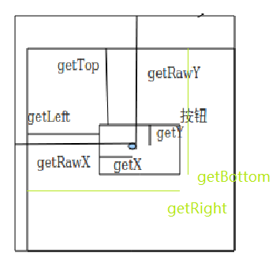

# 1 View介绍

View即代表视图，表示用户界面的基本模块，一个View占据了屏幕上的一个举行区域，并负责这个区域的绘制与事件处理。
其次View是安卓系统所有UI控件的基类，而ViewGroup作为View的容器，其自身也是继承自View。

---
  

# 2 View相关知识介绍

## 2.1 Android坐标系与视图坐标，View的位置参数

在Android中屏幕的最左上角作为Android坐标系的**原点坐标**，而**视图坐标**是View的父节点的左上角坐标

    View.getLocationInWindow()和  View.getLocationOnScreen()在window占据全部screen时，
    返回值相同，不同的典型情况是在Dialog中时。当Dialog出现在屏幕中间时，
    View.getLocationOnScreen()取得的值要比View.getLocationInWindow()取得的值要大。

在View中：

- x,y 表示view左上角在父View的坐标位置
- translationX,translationY，View的左上角相对于父容器偏移量，默认都是0
- top，bottom，left，right 看下图：

其中translationX和translationY只能通过View自身的setTranslationX和setTranslationY改变，改变之后会影响x和y

所以有一下公式：
x = left + translationX
y = top + translationY
right = left + getWidth();
bottom = top + getHeight();

## 2.2 与View相关的几个类

- MotionEvent 描述了一个事件
- ViewConfiguration 系统关于View系统的一些配置，如TouchSlop
- VelocityTracker 速度跟踪器
- GestureDetector 手势检测器
- Scroller与OverScroller 滑动帮助类
- ScaleGestureDetector 缩放手势帮助类
- Canvas View的绘制
- Paint/TextPaint View的绘制
- Path View的绘制相关

这些类对于掌握View的相关知识，进行自定义View都非常重要，接下来会逐个学习

   

# 2 自定义View

在平时的开发中，体系提供的View可能无法满足界面需求，所以不得不进行自定义View，而自定义View涵盖的知识面非常广，但是也可以对其进行细致的分类，对于各个类别中都有其侧重的技术点，根据View的体系我们可以作如下**分类**：

1. **继承View**，重写onDraw方法

 对于一些特殊的界面效果，无法使用已有的组件进行组合来达到这种效果，则可以考虑通过实现View的onDraw方法来实现自定义绘制。这种情况下需要对View的wrap_content属性进行处理，因为系统的View默认只支持match_parent。

2. **继承ViewGroup**，派生出特殊的layout

 这种方式是需要实现特定的布局，而传统的布局无法满足界面需求，需要处理自身及子view的测量(onMeasure)，和子view的布局(onLayout)。如果还有滑动相关的逻辑还需要处理好View的事件分发。

3. **继承特殊的View**，如TextView

 对已有的View做功能加强或改变某些行为

4. **继承特定的ViewGroup**，如LinearLayout

---
##  2.1 自定义view需要掌握的知识
对于自定义View除了上面提到的一些类之类，我们还需要熟悉下面列出的技能点：
- setContenLayout的处理流程
- LayoutInflater inflate布局的流程
- view的事件分发
- view的绘制流程(遍历的过程)：测量、布局、绘制
- invalidate与postInvalidated的执行过程
- 熟悉view的绘制技巧，最好有一定的数学知识

## 2.2 自定义View须知

1. 让View支持wrap_content
2. 如果有需要，让view支持padding，让ViewGroup支持margin
3. 尽量不要再View中使用Handler，因为View本身就有post系列方法
4. View中如果有线程或者动画，需要及时停止，参考onDetachedFromWindow
 onDetachedFromWindow会在View被remove或者所在Activity退出时调用，与onAttachedToWindow对应
5. View如果有滑动逻辑，处理好滑动冲突
6. 如果可以使用代码完成的布局，尽量不要使用xml，因为代码布局比xml布局快很多

---
  
