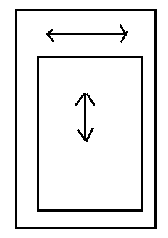
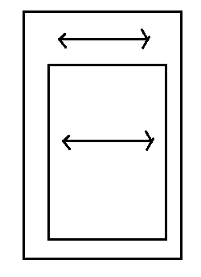
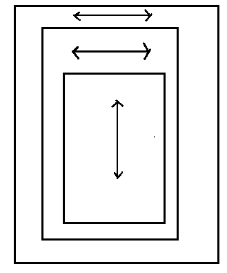

# 1 事件分发流程

通过前面的事件分发研究，我们可以总结出事件分发的流程：

在ViewGroup的dispatchTouchEvent中

1. 处理DOWN事件，在down事件中，如果拦截了事件则自己处理(onTouchEvent方法被调用)，子无法在获取事件了，如果不拦截DOWN事件，则会从外到内查找是否有子view能处理事件，如果有一个子view可以处理事件(down返回true)，则接下来的事件交给子view处理，ViewGroup的onInterceptTouchEvent方法还是会被调用，一旦其返回true，那么ViewGroup开始拦截事件，而子view以一个cancel事件结束

2. 接下来的move和up事件，如果在down中没有找到可以处理事件的子view，则自己处理接下来的事件。

3. 如果有子view可以处理事件，并且不拦截事件，则把事件都交给子view处理，一旦ViewGroup开始拦截，那么接收事件的子view将会被赋值为null，接下来事件遵循第二点。

4. 如果子view能接收到DWON事件，并且在接收到事件事件后，调用requestDisallowInterceptTouchEvent(true)方法，ViewGroup无法再拦截事件，也就说requestDisallowInterceptTouchEvent优先级高于onInterceptTouchEvent，但是requestDisallowInterceptTouchEvent不能干预父view对DOWN事件的处理。对于DOWN事件onInterceptTouchEvent说了算。

# 2 关于事件分发的规律总结(参考Android开发艺术探索)

1. **同一个事件序列**是指从手指触摸屏幕那一刻起，到手指离开屏幕的那一刻结束,所以一些列事件由：
`一个DOWN + 不数量的MOVE + 一个UP事件(可能CANCEL) `
组成

2. 正常情况下，**一个事件只能被一个View拦截和消费**，也就是说同一个事件不可能被两个View共同来消费，但是如果一个View接收到事件并处理后有分发给其他View处理除外。

3. 如果一个ViewGroup能接收到事件，并且开始拦截事件，那么这一系列事件只能由它来处理。并且他的onInterceptTouchEvent方法不会再被调用。

 关于ViewGroup能否接收到事件又分为两种：
 - 在DOWN就开始拦截事件
 - 在DOWN没有拦截事件，但是子view处理了DOWN事件并且没有改变FLAG_DISALLOW_INTERCEPT这个标志位来不允许父View拦截事件，之后ViewGroup的onInterceptTouchEvent依然会被调用，如果返回true，ViewGroup还是可以拦截事件，之后可接收事件的子View收到一个CANCEL事件，然后在ViewGroup中被置为null

4. FLAG_DISALLOW_INTERCEPT 和 touchTarget在一系列事件的开始和结尾都会被重置,也就是说子View无法使用requestDisallowInterceptTouchEvent方法来要影响DOWN事件，如果ViewGroup在DOWN就开始拦截事件，子view不可能再得到事件

5. 如果一个View开始接收事件，如果它不消费DOWN事件(DOWN中返回false)，那么它不会接收到同系列事件中接下来的事件，在源码中的体现就是，ViewGroup在DOWN事件中没有找到可以处理事件的子view，接下来的同系列事件就会自己处理，即他的onTouchEvent方法被调用

6. 如果一个View开始接收事件，如果它消费了DOWN事件(DOWN中返回true),但是接下来的事件它返回false，这个View依然能继续接收这一系列的事件，直到UP(或CANCEL)事件结束，最终事件会回到Activity的onTouchEvent方法，由Activity处理

7. View不拦截事件，它接收到事件会里面调用onTouchEvent方法，ViewGroup默认不拦截事件

8. 如果一个View是可以被click或者longClick的，那么它的onTouchEvent方法默认都会消费事件，即使它是不可用的(disable)，disable只会导致click或者longClick不被调用：
 - onClick发生前提，View可以点击，View能接收到Down和Up事件

9. focus对View的点击事件有影响，View的isFocusable和isFocusableInTouchMode为true并且当前没有获取到焦点，则会先请求焦点，此次点击不会响应click等事件

10. 事件是由外到内进行传递的，由内到外进行处理的，即事件总是先传给根View，再由根View传递给子View，而默认的处理顺序是子View到根View，ViewGroup可以全部拦截事件，子View可以调用requestDisallowInterceptTouchEvent干预父View的事件分发(DOWN事件无法被干预)

11. 当然对于某些特殊的需求，系统的dispatchTouchEvent方法可能不适用，那么需要重写ViewGroup的dispatchTouchEvent方法，那么事件分发的逻辑完全有我们定义。只要ViewGroup能接收到事件，它的dispatchTouchEvent每次都会被调用。

12. 如果ACTION_DOWN事件发生在某个View的范围之内，则后续的ACTION_MOVE，ACTION_UP和ACTION_CANCEL等事件都将被发往该View，即使事件已经出界了。

13. 第一根按下的手指触发ACTION_DOWN事件，之后按下的手指触发ACTION_POINTER_DOWN事件，中间起来的手指触发ACTION_POINTER_UP事件，最后起来的手指触发ACTION_UP事件（即使它不是触发ACTION_DOWN事件的那根手指）。

14. pointer id可以用于跟踪手指，从按下的那个时刻起pointer id生效，直至起来的那一刻失效，这之间维持不变（后续MotionEvent会详细解读）。

15. 如果父View在onInterceptTouchEvent中拦截了事件，则onInterceptTouchEvent中不会再收到Touch事件了，事件被直接交给它自己处理（按照普通View的处理方式）。

16. 如果一个事件首先由子view处理，但是如果子view在处理的过程中某个时刻返回了false，则此事件序列全部交给Activity处理。

# 3 关于事件分发中的滑动冲突

常见的滑动冲突场景：

- 1，外部滑动方向与内部滑动方向不一致
- 2，内部滑动方向与外部滑动方向一致
- 3，上述两种情况的嵌套

####滑动冲突场景：

场景1：

类似ViewPager与多个ListFragemnt嵌套

场景2：

类似ViewPager与ViewPager的嵌套

场景3：

类似SlidMenu加ViewPager加ListFragment

###解决滑动冲突的规则

- 对于场景1有以下方法来解决
 - 判断滑动路径与水平方向夹角
 - 判断水平方向与垂直方向的距离差(常用)
 - 判断水平方向与垂直方向的速度差

- 对于场景2
 - 这能通过业务需求来解决，比如某个情况只允许哪个View滑动

---

---

最后把一篇关于TouchMode的文章摘录在此：

[Android touch mode和focusableInTouchMode分析](http://www.cnblogs.com/xiaoweiz/p/3833079.html)

　　首先我们来看看touch mode的定义。它是用户和手机进行交互时view层次结构的一个状态。它本身是很容易理解的，

代表了最近一次的交互是否是通过触摸屏发生的，因为在Android设备上还存在别的交互方式，比如D-pad、滚动球等等。

　　为什么Android会引入这样一个mode呢？这是因为从交互、设计方面考虑，当用户直接使用keys或trackball与UI

进行交互的时候，必须先使目标控件获得焦点(比如高亮起来)，这样用户才会注意到是什么控件在接收输入。然而如果设备支持触摸手势的话，用户直接用手指点击控件，这个时候当然就没必要将目标控件高亮了（即获取焦点）。对于一个拥有触摸屏功能的设备而言, 一旦用户用手点击屏幕, 设备会立刻进入touch mode。这时候被点击的控件只有isFocusableInTouchMode()为true的时候才会获得focus，比如EditText控件。其他可以触摸的控件比如Button（其isFocusableInTouchMode默认为false）, 当被点击的时候不会获取焦点，它们只是简单地执行onClick事件而已。任何时候只要用户点击key或滚动trackball, 设备就会退出touch mode，并且找一个view将焦点置于其上，这样用户可以在不需要再次触摸屏幕的情况下接着和UI进行交互。touch mode在整个系统运行期间都是有效的(跨activities)，任何时候都可以调用View.isInTouchMode()方法来查看当前设备是否处于touch mode状态。从上面的介绍我们能看出来，在触摸屏下的view，设置了focusableInTouchMode和没设置在用户体验上是不同的，其实内部的处理逻辑也是不同的，比如：没设置这个属性的控件在用户触摸交互时是不会获得focus的，也就是说focus在touch过程中是不会改变的，只是其onClickListener如果设置了的话会在up事件到来时触发。而如果设置了focusableInTouchMode属性的话，它的行为是首先尝试获得focus，如果获得成功的话其onClickListener是不会触发的，只有当你第2次再点击它时，

才会执行onClickListener。可能有些同学在开发中也遇到过这个问题，stackoverflow上有一个同样的问题：

http://stackoverflow.com/questions/20473355/button-is-not-calling-onclicklistener-with-first-click?lq=1，

大家可以参考下。由于设置了这个属性后会引起和android正常交互行为的不一致，所以android建议我们保守地使用这个属性，

在你确定要用它之前最好三思而后行，并且确保你自己看过Android developers blog里关于touch mode介绍的文章：

[http://android-developers.blogspot.com/2008/12/touch-mode.html](http://android-developers.blogspot.com/2008/12/touch-mode.html)

　　关于设置了这个属性后行为不一致的问题，我们在touch事件的处理过程的源码分析也提到过。
