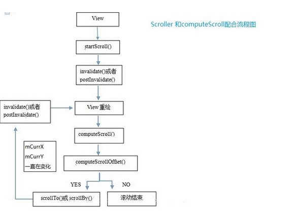

# View实现滑动的方式以及对View内部变量的影响

- ScrollTo/ScrollBy
- offsetTopAndBottom和offsetLeftAndRight
- layoutParams
- onLayout
- Scroller
- ViewDragHelper
- 动画

---

## 1，ScrollTo/ScrollBy

> 这两个方法移动的是View的content，如果在ViewGroup中移动的是ViewGroup的所有子view。如果在View中使用，那么移动的就是View的内容，类如TextView，content就是它的文本，ImageView，content就是他的drawable

###View的视图移动理解

> 手机屏幕是一个中空的盖板，盖板下面是一个巨大的画布，也就是我们需要显示的内容，把这个盖板盖在画布的某一处时，透过中间的矩形，我们看见了手机屏幕上显示的视图，而画布上的其他视图，被盖住了无发看见,在手机屏幕上，我们看不见的视图，不代表它不存在，可能就是被盖住了（在屏幕外面），当调用scrollTo方法时，可以理解为外面的盖板在移动

>scrollBy(dx , dy);
所以在scrollBy方法中,dx与dy为正数，视图将向坐标轴的负方向移动；dx与dy为负数，视图将向坐标轴的正方向移动。

> 我的理解就是你手机往下滑动的时候，你希望看到的是view的content往下移动了，而如果你用的是scrollTo/scrollBy方法,你直接滑动的是那个遮罩，所有你看到的现象刚好相反，遮罩像下移动，你看到的是View的conten的下面的内容，所以你把dx,dy取负数，这时遮罩是往上面移动，就好像是view的content往下移动一样。

###实现方法：

    //记录手指按下的位置
    private int lastX, lastY;
        @Override
        public boolean onTouchEvent(MotionEvent event) {
            int x = (int) event.getX();
            int y = (int) event.getY();
            int action = event.getAction();
            switch (action) {
                case MotionEvent.ACTION_DOWN:
                    lastX = x;
                    lastY = y;
                    break;
                case MotionEvent.ACTION_MOVE:
                    //计算出手指的距离
                    int dx = x - lastX;
                    int dy = y - lastY;
                    //调用scrollBy实现滑动
                    scrollBy(-dx , -dy);
                    break;
                case MotionEvent.ACTION_UP:
                    break;
            }
            lastY = y;
            lastX = x;
            return true;
        }

####对View内部变量的影响：

调用scrollTo/scrollBy滑动的是View的content，影响的是View的**mScrollX**与**mScrollY**。会调用的方法是**onScrollChanged**,在ViewGroup中调用scrollTo/scrollBy，不会对子view的各种参数如：top,left,x,y等造成影响。

mScrollX的值总是等于View的左边缘与View的内容左边缘的水平方向距离。mScrollY类似

mScrollX、mScrollY更详细的说就是:
**视图的内容的偏移量，而不是视图相对于其他容器或者视图的偏移量**。也就是说，移动的是视图里面的内容

**但是在absListView中的滑动则会改变子view的top，left，x，y等相关变量**，因其复用机制。

---
   

## 2，offsetTopAndBottom和offsetLeftAndRight

offsetTopAndBottom和offsetLeftAndRight是实实在在的改变View在ViewGroup中的位置。

####实现方式：

      private int lastX, lastY;
        @Override
        public boolean onTouchEvent(MotionEvent event) {
            int x = (int) event.getX();
            int y = (int) event.getY();
            int action = event.getAction();
            switch (action) {
                case MotionEvent.ACTION_DOWN:
                    lastX = x;
                    lastY = y;
                    break;
                case MotionEvent.ACTION_MOVE:
                    int dx = x - lastX;
                    int dy = y - lastY;
                    getChildAt(0).offsetTopAndBottom(dy);
                    getChildAt(0).offsetLeftAndRight(dx);
                    break;
                case MotionEvent.ACTION_UP:
                    break;
            }
            lastY = y;
            lastX = x;
            return true;
        }

####对View内部变量的影响：
view自身调用了offsetTopAndBottom和offsetLeftAndRight方法对应其内部的**top，bottom，left，right，x，y**都会素质改变

---
   

## 3，LayoutParams

每一个View都有其LayoutParams对应的LayoutParams，具体的LayoutParams跟它的父布局有关，LayoutParams描述了View一系列信息，保存View的大小，位置等。所以可以通过动态的改变这些数据来达到View的滑动，当然LayoutParams不止可以做这些。

####实现方式：

    private int lastX, lastY;

        @Override
        public boolean onTouchEvent(MotionEvent event) {
            int x = (int) event.getX();
            int y = (int) event.getY();
            int action = event.getAction();
            switch (action) {
                case MotionEvent.ACTION_DOWN:
                    lastX = x;
                    lastY = y;
                    break;
                case MotionEvent.ACTION_MOVE:
                    int dx = x - lastX;
                    int dy = y - lastY;
                    MarginLayoutParams marginLayoutParams = (MarginLayoutParams) getChildAt(0).getLayoutParams();

                    marginLayoutParams.leftMargin += dx;
                    marginLayoutParams.topMargin += dy;

                    getChildAt(0).setLayoutParams(marginLayoutParams);

                    break;
                case MotionEvent.ACTION_UP:
                    break;
            }
            lastY = y;
            lastX = x;
            return true;
        }

####对View内部变量的影响：
改变了View的布局参数，肯定其内部的参数也是改变了，同第二种方法

---
   
## 4，onLayout

在ViewGroup中，通过onLayout来确定来确定子view的位置，所以我们也可以通过反复的调用这个方法来实现子View的滑动

####实现方式：

    private int lastX, lastY;

        @Override
        public boolean onTouchEvent(MotionEvent event) {
            int x = (int) event.getX();
            int y = (int) event.getY();
            int action = event.getAction();
            switch (action) {
                case MotionEvent.ACTION_DOWN:
                    lastX = x;
                    lastY = y;
                    break;
                case MotionEvent.ACTION_MOVE:
                    int dx = x - lastX;
                    int dy = y - lastY;

                    int l = getChildAt(0).getLeft() + dx;
                    int t = getChildAt(0).getTop() + dy;
                    getChildAt(0).layout(l, t, l + getChildAt(0).getWidth(), t + getChildAt(0).getHeight());

                    break;
                case MotionEvent.ACTION_UP:
                    break;
            }
            lastY = y;
            lastX = x;
            return true;
        }

####对View内部变量的影响：
改变了View的布局位置，肯定其内部的参数也是改变了，同第二种方法

---
   
## 5，Scroller与OverScroller
OverScroller是对Scroller的功能增强，其是它们只是一个辅助计算的工具，告诉我们在某一时刻View应该在哪一个位置，我们还是要调用**scrollTo**方法来实现滑动.
调用过程：
`invalidate()-->onDraw()-->computeScroll()`

具体实现的方式就不贴了，

---
   
## 6，ViewDragHelper
ViewDragHelper位于support v4包中，DrawerLayoou和SlidingPaneLayout就是用ViewDrawHelper实现的，ViewDragHelper的功能非常强大，会在另外的笔记中详细学习，其内部也是使用的offsetTopAndBottom和offsetLeftAndRight方法。

---
   
## 7,使用动画

使用动画来实现View的滑动，主要是改变View的translationX和translationY,既可以使用传统的动画也可以使用3.0的属性动画，如果需要兼容到3.0一下，考虑使用nineOldAndroid开源项目

- 传统动画只是改变View的影响，View的位置参数并没有改变，包括View的位置参数都没有改变，而使用3.0的属性动画则不会。

- nineOldAndroid本质上还是View的动画

一句简单的代码即可实现View的滑动：

    view.animate().translationX(300).translationY(-300).setDuration(4000).start();

####对View内部变量的影响：
对top，bottom，right，left没有影响，会改变x，y，translationX和translationY.

也就是这个公式了：
x = left + translationX
y = top + translationY

动画适合做没有交互的View的滑动效果。
