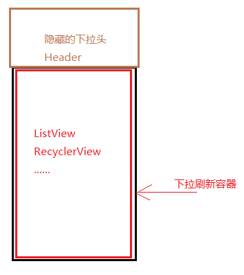
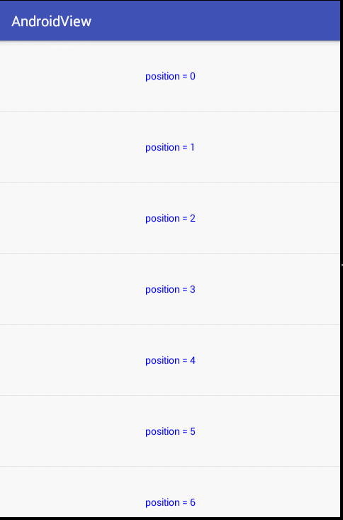

# 1 外部拦截法

外部拦截法即事件都经过父容器处理，如果父容器需要事件就处理事件，不需要则不拦截，下面来看一下伪代码：

        @Override
        public boolean onInterceptHoverEvent(MotionEvent event) {
            boolean intercept = false;
            int x = (int) event.getX();
            int y = (int) event.getY();
            int action = event.getActionMasked();
            switch (action) {
                case MotionEvent.ACTION_DOWN:
                    //如果希望子view能接收到事件，DOWN必然要返回false
                    intercept = false;
                    break;

                case MotionEvent.ACTION_MOVE:
                    //如果需要拦截事件，就返回true
                    if (needIntercept(event)) {
                        intercept = true;
                    } else {
                        intercept = false;
                    }
                    break;

                case MotionEvent.ACTION_UP:
                    //手指抬起，必须返回false，因为返回值对自己没有影响，而对子view可能有影响
                    intercept = false;
                    break;
            }
            //重新设置最后一次位置
            mLastEventX = x;
            mLastEventY = y;
            return intercept;
        }

        private boolean needIntercept(MotionEvent event) {
            return false;
        }

下面来分析一下这段伪代码的意思：

1. 首先ACTION_DOWN必须返回false，否则子view无法接收到事件，事件都会由自己处理
2. 对应ACTION_MOVE则对自己根据情况处理，需要就拦截，否则不拦截
3. 最后是ACTION_UP，必须返回false，原因有：
 - ACTION_UP的返回值对自身并没有影响，自身始终能接收到事件
 - 如果子一些列事件中，ViewGroup都始终没有拦截事件，却在ACTION_UP中返回true，这样导致子view无法接收到UP事件，那么就会影响子view的click事件，或者其他逻辑处理
4. 是否需要拦截事件都交给needIntercept方法处理，这个处理是根据业务来处理的，还可如果我们无法确定某些因素，还可以通过设置回调接口来处理，让其他对象通过接口来告知感兴趣的事。

 如下面代码：

         private boolean needIntercept(MotionEvent event) {
            if (mEventCallback != null) {
               return mEventCallback.isCanIntercept();
            }
            return false;
        }

        public EventCallback mEventCallback;

        public void setEventCallback(EventCallback eventCallback) {
            mEventCallback = eventCallback;
        }
        public interface EventCallback{
            boolean isCanIntercept();
        }

在外部拦截法中，子view最好不要使用requestDisallowInterceptTouchEvent来干预事件的处理

# 2 内部拦截法

内部拦截是指父容器不拦截任何事件，所有事件都传递给子view，如果子元素需要事件就直接消耗，否则交给父容器处理，这种拦截法需要配合requestDisallowInterceptTouchEvent方法来使用。我们需要重写子view的dispatchTouchEvent方法。

      private int mLastX, mLastY;
        @Override
        public boolean dispatchTouchEvent(MotionEvent event) {
            int action = event.getActionMasked();
            int x = (int) event.getX();
            int y = (int) event.getY();
            switch (action) {
                case MotionEvent.ACTION_DOWN:
                    //不让父View拦截事件
                    mLastX = x;
                    mLastY = y;
                    getParent().requestDisallowInterceptTouchEvent(true);
                    break;

                case MotionEvent.ACTION_MOVE:
                    //如果需要拦截事件，就返回true
                    if (!needIntercept(event)) {
                        getParent().requestDisallowInterceptTouchEvent(false);
                    }
                    break;

                case MotionEvent.ACTION_UP:
                    //手指抬起，必须返回false，因为返回值对自己没有影响，而对子view可能有影响
                    break;
            }
            mLastX = x;
            mLastY = y;
            return super.dispatchTouchEvent(event);
        }

代码说明：
- 首先，必须假定父view不拦截DOWN事件而拦截其他事件，否则子view无法获取任何事件。在子view调用requestDisallowInterceptTouchEvent(false)后，父view才能继续拦截事件
- 其次在ACTION_DOWN时，调用requestDisallowInterceptTouchEvent(true)来不允许父View拦截事件
- ACTION_MOVE中如果needIntercept返回false，则调用requestDisallowInterceptTouchEvent(false)让父view重新拦截事件，需要注意的是，一点调用此方法，就表示放弃了同系列的事件的所有事件。
- 最后调用requestDisallowInterceptTouchEvent后触发我们的onTouchEvent方法，处理时间

所以父元素的拦截逻辑如下：

      @Override
        public boolean onInterceptHoverEvent(MotionEvent event) {
            boolean intercept = false;
            int x = (int) event.getX();
            int y = (int) event.getY();
            int action = event.getActionMasked();
            if(action == MotionEvent.ACTION_DOWN){
                     return false;
            }else{
                     return true
            }
       }  

# 3 重定义dispatchTouchEvent方法

上面两种方法基本还是尊重系统的事件分发机制，但是还是有一些情况无法满足，这时候，我们需要根据业务需求来重新定义事件分发了。

比如一个下拉刷新模式

首先我们定义：
下拉刷新容器为： A
列表布局为ListView：B
刷新头为：C

逻辑如下：
首先A或获取到事件，如果手机方向被认定为垂直滑动，A要判断C的位置和滑动方向：

1，C刚好隐藏，此时向下滑动，B这时无法向下滑动

A需要拦截事件，自己处理，让C显示出来，此时A需要拦截事件，自己处理，让C显示出来，如果手指又向上滑动，则A又要判断C是否隐藏，没有隐藏还是A拦截并处理事件，当C完全隐藏后，又要吧事件交给B处理，B来实现自己列表View该有的特性

就这个逻辑上述方案1和方案2就无法满足，**因为系统的事件分发有一个特点**：

- **当一个ViewGroup开始拦截并处理事件后，这个事件只能由它来处理，不可能再把事件交给它的子view处理，要么它消费事件，要么最后交给Activity的onTouchEvent处理**

 >在代码中就是，只要ViewGroup拦截了事件，他的dispatchTouchEvent方法中接收事件的子view就会被置为null，

此特点：
- 套用到方案1外部拦截法就是，在MOVE中，开始拦截事件，View收到一个Cancel事件后，之后都无法获取到同系列事件了。
- 套用到方案2就是在MOVE中调用requestDisallowInterceptTouchEvent(false)就表示完全放弃同系列事件的所有事件了

# 4 Demo

说了这么方案，现在来一个实例，需求
定义一个ViewGroup，布局方向为横向布局，可以左右滑动切换子view，同时只显示一个子view，类似ViewPager，其次ViewGroup内部放置ListView，来制造滑动冲突，我们需要解决这种冲突。

我们的自定义HScrollLayout代码如下：

    package com.ztiany.view.views;

    import android.content.Context;
    import android.util.AttributeSet;
    import android.util.Log;
    import android.view.MotionEvent;
    import android.view.VelocityTracker;
    import android.view.View;
    import android.view.ViewGroup;
    import android.view.animation.AccelerateDecelerateInterpolator;
    import android.widget.Scroller;

    /**
     * @author Ztiany
     *         email 1169654504@qq.com & ztiany3@gmail.com
     *         date 2015-12-03 15:23
     *         description
     *         vsersion
     */
    public class HScrollLayout extends ViewGroup {

        public HScrollLayout(Context context) {
            this(context, null);
        }

        public HScrollLayout(Context context, AttributeSet attrs) {
            this(context, attrs, 0);
        }

        public HScrollLayout(Context context, AttributeSet attrs, int defStyleAttr) {
            super(context, attrs, defStyleAttr);
            init();
        }

        public static final String TAG = HScrollLayout.class.getSimpleName();

        private int mLastEventX, mLastEventY;
        private VelocityTracker mVelocityTracker;
        private Scroller mScroller;
        private int mWidth;
        private int mCurrentPage;

        private void init() {
            //设置方向为横向布局
            mScroller = new Scroller(getContext(), new AccelerateDecelerateInterpolator());
            mVelocityTracker = VelocityTracker.obtain();

        }

        @Override
        public boolean onInterceptTouchEvent(MotionEvent event) {

            if (getChildCount() < 0) {
                return false;
            }

            boolean intercept = false;
            int x = (int) event.getX();
            int y = (int) event.getY();
            int action = event.getActionMasked();
            switch (action) {
                case MotionEvent.ACTION_DOWN:

                    if (!mScroller.isFinished()) {
                        mScroller.abortAnimation();
                        intercept = true;
                    } else {
                        //如果希望子view能接收到事件，DOWN必然要返回false
                        intercept = false;
                        mLastEventX = x;
                        mLastEventX = y;
                    }

                    break;

                case MotionEvent.ACTION_MOVE:
                    //计算移动差
                    int dx = x - mLastEventX;
                    int dy = y - mLastEventY;
                    if (Math.abs(dx) > Math.abs(dy)) {
                        intercept = true;
                    } else {
                        intercept = false;
                    }
                    break;

                case MotionEvent.ACTION_UP:
                    //手指抬起，必须返回false，因为返回值对自己没有影响，而对子view可能有影响
                    intercept = false;
                    break;
            }
            mLastEventX = x;
            mLastEventY = y;
            return intercept;

        }

        @Override
        protected void onLayout(boolean changed, int l, int t, int r, int b) {
            Log.d(TAG, "l:" + l);
            Log.d(TAG, "t:" + t);
            Log.d(TAG, "r:" + r);
            Log.d(TAG, "b:" + b);
            int left = l, top = t, right = r, bottom = b;
            if (changed) {
                int childCount = getChildCount();
                View child;
                for (int i = 0; i < childCount; i++) {
                    child = getChildAt(i);
                    if (child.getVisibility() == View.GONE) {
                        continue;
                    }
                    child.layout(left, top, left + child.getMeasuredWidth(), bottom);
                    left += child.getMeasuredWidth();
                }
            }

        }

        @Override
        public boolean onTouchEvent(MotionEvent event) {

            mVelocityTracker.addMovement(event);
            int x = (int) event.getX();
            int y = (int) event.getY();
            int action = event.getActionMasked();
            switch (action) {
                case MotionEvent.ACTION_DOWN:
                    mLastEventX = x;
                    mLastEventX = y;
                    break;

                case MotionEvent.ACTION_MOVE:
                    int dx = x - mLastEventX;
                    scrollBy(-dx, 0);

                    break;

                case MotionEvent.ACTION_UP:
                case MotionEvent.ACTION_CANCEL:
                    //将要滑动的距离
                    int distanceX;
                    mVelocityTracker.computeCurrentVelocity(1000);
                    float xVelocity = mVelocityTracker.getXVelocity();

                    Log.d(TAG, "xVelocity:" + xVelocity);

                    if (Math.abs(xVelocity) > 50) {
                        if (xVelocity > 0) {//向左
                            mCurrentPage--;
                        } else {
                            mCurrentPage++;
                        }

                    } else {
                        // 不考虑加速度
                        Log.d(TAG, "getScrollX():" + getScrollX());
                        if (getScrollX() < 0) {//说明超出左边界
                            mCurrentPage = 0;
                        } else {
                            int childCount = getChildCount();
                            int maxScroll = (childCount - 1) * mWidth;
                            Log.d(TAG, "maxScroll:" + maxScroll);
                            if (getScrollX() > maxScroll) {//超出了右边界
                                mCurrentPage = getChildCount() - 1;
                            } else {

                                //在边界范围内滑动
                                int currentScrollX = mCurrentPage * mWidth;//已近产生的偏移
                                int offset = getScrollX() % mWidth;
                                Log.d(TAG, "mWidth:" + mWidth);
                                Log.d(TAG, "offset:" + offset);

                                if (currentScrollX > Math.abs(getScrollX())) {//向左偏移

                                    if (offset < (mWidth - mWidth / 3)) {//小于其 2/3
                                        mCurrentPage--;
                                    } else {

                                    }

                                } else {//向右偏移

                                    if (offset > mWidth / 3) {//小于其 2/3
                                        mCurrentPage++;
                                    } else {

                                    }

                                }

                            }
                        }
                        //不考虑加速度
                    }
                    mCurrentPage = (mCurrentPage < 0) ? 0 : ((mCurrentPage > (getChildCount() - 1)) ? (getChildCount() - 1) : mCurrentPage);
                    distanceX = mCurrentPage * mWidth - getScrollX();
                    Log.d(TAG, "distanceX:" + distanceX);
                    smoothScroll(distanceX, 0);
                    mVelocityTracker.clear();
                    break;
            }
            mLastEventX = x;
            mLastEventY = y;
            //返回true，处理事件
            return true;
        }

        private void smoothScroll(int distanceX, int distanceY) {
            mScroller.startScroll(getScrollX(), 0, distanceX, 0, 500);
            invalidate();
        }

        @Override
        public void computeScroll() {
            if (mScroller.computeScrollOffset()) {
                scrollTo(mScroller.getCurrX(), mScroller.getCurrY());
                invalidate();
            }
        }

        /**
         * 重写测量逻辑
         *
         * @param widthMeasureSpec
         * @param heightMeasureSpec 这里我们不考虑wrap_content的情况,也不考虑子view的margin情况
         */
        @Override
        protected void onMeasure(int widthMeasureSpec, int heightMeasureSpec) {

            int widthSize = MeasureSpec.getSize(widthMeasureSpec);
            int heightSize = MeasureSpec.getSize(heightMeasureSpec);

            int childCount = getChildCount();
            View child;
            for (int i = 0; i < childCount; i++) {
                child = getChildAt(i);
                if (child.getVisibility() == View.GONE) {
                    continue;
                }
                measureChild(child, MeasureSpec.makeMeasureSpec(widthSize, MeasureSpec.EXACTLY),
                        MeasureSpec.makeMeasureSpec(heightSize, MeasureSpec.EXACTLY));
            }

            setMeasuredDimension(widthSize, heightSize);
        }

        @Override
        protected void onSizeChanged(int w, int h, int oldw, int oldh) {
            mWidth = w;
        }
    }

**Activity中代码如下：**

    package com.ztiany.view.activity;

    import android.graphics.Color;
    import android.os.Bundle;
    import android.support.v7.app.AppCompatActivity;
    import android.support.v7.widget.AppCompatTextView;
    import android.view.Gravity;
    import android.view.View;
    import android.view.ViewGroup;
    import android.widget.BaseAdapter;
    import android.widget.LinearLayout;
    import android.widget.ListView;
    import android.widget.TextView;

    import com.ztiany.view.R;
    import com.ztiany.view.views.HScrollLayout;

    public class EventDemoActivity extends AppCompatActivity {

        private HScrollLayout mHScrollLayout;

        @Override
        protected void onCreate(Bundle savedInstanceState) {
            super.onCreate(savedInstanceState);
            setContentView(R.layout.activity_event_deom);
            initViews();
            initListView();
        }

        private void initViews() {

            mHScrollLayout = (HScrollLayout) findViewById(R.id.id_act_event_hs);

        }

        private void initListView() {

            LinearLayout.LayoutParams lp;
            ListView listView;
            for (int i = 0 ; i < 3 ; i ++) {
                listView = new ListView(EventDemoActivity.this);
                lp = new LinearLayout.LayoutParams(ViewGroup.LayoutParams.MATCH_PARENT, ViewGroup.LayoutParams.MATCH_PARENT);
                listView.setLayoutParams(lp);
                listView.setAdapter(new Adapter(i));
                mHScrollLayout.addView(listView);
            }
        }

        private class Adapter extends BaseAdapter {

            private final int mType;

            Adapter(int type) {
                mType = type;
            }

            @Override
            public int getCount() {
                return 100;
            }

            @Override
            public Object getItem(int position) {
                return null;
            }

            @Override
            public long getItemId(int position) {
                return 0;
            }

            @Override
            public View getView(int position, View convertView, ViewGroup parent) {
                if (convertView == null) {
                    TextView textView = new AppCompatTextView(EventDemoActivity.this);
                    textView.setPadding(40, 40, 40, 40);
                    textView.setGravity(Gravity.CENTER);
                    convertView = textView;
                    if (mType == 0) {
                        textView.setTextColor(Color.BLUE);
                    } else if (mType == 1) {
                        textView.setTextColor(Color.RED);

                    } else {
                        textView.setTextColor(Color.GREEN);

                    }
                }
                TextView textView = (TextView) convertView;
                textView.setText("position = " + position);
                return convertView;
            }
        }

    }

内部拦截法类似，稍微修改一下即可，就不贴代码了
最后效果如下：

